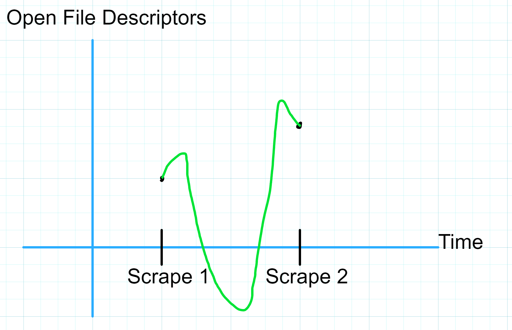

# Gauges

The second metric type we need to know about is a Gauge.

Gauges are very similar to Counters in that they are a floating point value that starts initialized to zero, however a Gauge can go both up and down and has the potential to be either a positive or negative number.

Gauges are useful metrics for tracking a specific internal state value that fluctuates up and down throughout service lifetime:
- Temperature of a sensor
- Bytes of memory currently allocated
- Number of pending requests in the queue
- Number of active routines
- Number of active TCP connections
- Number of open File Descriptors

In our example payload, the Gauge metric is represented as follows:

```
# HELP process_open_fds Number of open file descriptors.
# TYPE process_open_fds gauge
process_open_fds 16
```

Gauges are useful to interrogate the immediate internal state of a service at a given point in time.

Unlike with Counters, calculating the `rate()` of a Gauge doesn't really make sense since Gauge values can go up and down between observations.

We are unable to interpolate between two observations of a Gauge since we don't know the boundaries of possible values for the Gauge between the observations.



In the absence of a `rate()` style query, how can we contextualize a Gauge metric?

Prometheus provides us with [additional Range Vector functions](https://prometheus.io/docs/prometheus/latest/querying/functions/#aggregation_over_time) to help interpret the values of Gauges by aggregating observations over time.

In the previous chapter on Counters, I introduce a concept of a [Range Vector](counters.md#range-vectors-and-the-rate-query) and walk through how the `rate()` query operates on such vectors. We'll be using Range Vectors below so feel free to go back and review if you need a refresher.

Below is a list of a few of the functions we can use to better understand what our Gauge is telling us about our service:
- `avg_over_time()`
  - Take all values in the range vector, add them up, and divide the sum by the number of observations in the vector.
- `min_over_time()`
  - Take the lowest value in the range vector (remember, Gauge values can be both positive or negative).
- `max_over_time()`
  - Take the highest value in the range vector.
- `sum_over_time()`
  - Take all values in the range vector and add them up.
- `quantile_over_time()`
  - Keep reading for a breakdown.

There are a few others available to us but for the purposes of this chapter we'll explore the above five functions in a practical scenario.

## The Quantile Function

The [Quantile Function](https://en.wikipedia.org/wiki/Quantile_function) is a commonly used function in probability theory and statistics but I am neither a statistician or probabilist.

Thankfully we don't need probability theory to understand what `quantile_over_time()` does and how it works.

Given a Range Vector (list of successive observations of a Gauge) `vec` and a target Quantile of `0.90`, `quantile_over_time(0.90, vec)` returns the value at the _90th percentile_ of all observations in `vec`.

Recall that the _50th percentile_ of a series of numbers, also called the _median_, is the member of the series at which half of the remaining numbers in the series fall below and the other half fall above.

For a sample series:

```
[25, 45, 34, 88, 76, 53, 91, 21, 53, 12, 6, 37, 97, 50]
```

We find the _median_ by sorting the series least-to-greatest and picking the value in the middle, or in the case of a series of even length, we average the two middle-most numbers.

```
[6, 12, 21, 25, 34, 37, (45, 50), 53, 53, 76, 88, 91, 97]
```

\\[ \frac{45 + 50}{2} = 47.5\\]

So in this example our _median_ is `47.5` which is the same as the _50th percentile_ of the series.

Okay, so what does that make the _90th percentile_? Well the _90th percentile_ of a series is the value for which 90% of the numbers in the series fall below and 10% of the numbers in the series fall above.

So given our example series, how do we find the _90th percentile_?

Well if we have an ordered series of numbers, we'd want to grab the value at position `0.9 * n` where `n` is the number of values in the series, since that would split the series into two chunks, one with 90% of the values and one with 10% of the values. In our example series, we have 14 values, so we'd take the value at position `0.9 * 14 = 12.6`.

Since our series has 14 numbers in it, it is impossible to find a value at which exactly 90% of the values fall below it and 10% fall above it (14 is not divisible by 10), so we can estimate the _90th percentile_ for our series by taking the weighted average of the values on either side of the split point.

```
[6, 12, 21, 25, 34, 37, 45, 50, 53, 53, 76, (88, 91), 97]
```

\\[ (88 * (1-0.6)) + (91 * 0.6) = 89.8\\]


Now that we've cleared that up, it should be easy to get the _75th percentile_ of our Range Vector (or any other percentile we need), just use `quantile_over_time(0.75, vec)`.

If we look at the implementation of the `quantile_over_time()` function in the Prometheus [source](https://github.com/prometheus/prometheus/blob/main/promql/quantile.go#LL357-L386C2) we see a fairly straightforward Go function that does the same process we just walked through:

```go
// quantile calculates the given quantile of a vector of samples.
// ...
func quantile(q float64, values vectorByValueHeap) float64 {
	//...
	sort.Sort(values)

	n := float64(len(values))
	// When the quantile lies between two samples,
	// we use a weighted average of the two samples.
    // Multiplying by (n-1) because our vector starts at index 0 in code
	rank := q * (n - 1) 

	lowerIndex := math.Max(0, math.Floor(rank))
	upperIndex := math.Min(n-1, lowerIndex+1)

	weight := rank - math.Floor(rank)
	return values[int(lowerIndex)].V*(1-weight) + values[int(upperIndex)].V*weight
}
```

## Querying Gauge Metrics

Now let's put these functions into practice and learn a bit about our example metric, `process_open_fds`.

TODO: write about querying Gauge metrics
