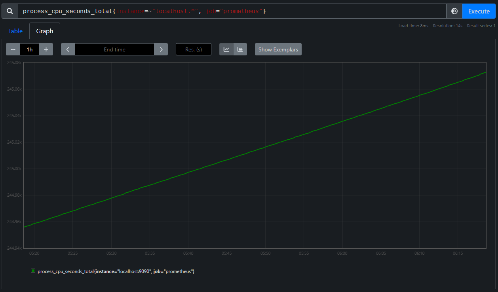

# Metrics

## What Metrics are Not

Metrics are not a silver bullet to solving all your production issues. In fact, in a world of microservices where each service talks to a number of other services in order to serve a request, metrics can be deceptive, difficult to understand, and are often missing where we need them most because we failed to anticipate what we should have been measuring.

> In a modern world, debugging with metrics requires you to connect dozens of disconnected metrics that were recorded over the course of executing any one particular request, across any number of services or machines, to infer what might have occurred over the various hops needed for its fulfillment. The helpfulness of those dozens of clues depends entirely upon whether someone was able to predict, in advance, if that measurement was over or under the threshold that meant this action contributed to creating a previously unknown anomalous failure mode that had never been previously encountered.[^1]

That being said, metrics can be useful in the process of debugging and triaging production incidents. Metrics provide a helpful summary of the state of a system, and while they may not hold all the answers, they allow us to ask more specific questions which help to guide investigations. Additionally, metrics can be the basis for alerts which provide on-call engineers with early warnings, helping us catch incidents before they impact users.

## What Metrics Are

Metrics are numerical time-series data that describe the state of systems over time.

Common base metrics include the following:
- Latency between receiving a HTTP request and sending a response
- CPU seconds being utilized by a system
- Number of requests being processed by a system
- Size of response bodies being sent by a system
- Number of requests that result in errors being sent by a system

These base metrics are all things we can measure directly in a given system. They don't immediately seem useful in determining if something is wrong with the system but from these core metrics we can _derive_ higher level metrics that indicate when systems may be unhealthy.

Common derived metrics include:
- 95th Percentile of HTTP Request/Response Latency over the past 5 minutes
- Average and Maximum CPU Utilization % across all deployed containers for a system over the past hour
- Request throughput (\\( \frac{req}{s}\\)) being handled by a system over the past 5 minutes
- Ingress and Egress Bandwidth (\\( \frac{MB}{s}\\)) of a system over the past hour
- Error (\\(\frac{failed\ requests}{total\ requests}\\)) rate (\\( \frac{error}{s}\\)) of a system over the past 5 minutes

Derived metrics, when graphed, make it easy to visually pattern match to find outliers in system operation. Derived metrics can also be utilized for alerting when outside of "normal" operating ranges, but generally don't determine directly that there is something wrong with the system.

As engineers, we track base metrics in our systems and expose them for collection regularly so that our observability platform can record the change over time of these base metrics. We pick base metrics that provide measurable truth of the state of the system using absolute values where possible. With a large enough pool of base metrics, we can generate dozens of derived metrics that interpret the base metrics _in context_, making it clear to the viewer both _what_ is being measured and _why_ it is important.

### Labels

In most metrics systems, metrics are stored as multi-dimensional time series where the primary dimension is the actual metric value at a given time.

Labels are additional categorical dimensions for a metric that allow you to differentiate values by some property.

Example of labels for metrics are as follows:

| Metric                                 | Label                                                 |
| -------------------------------------- | ----------------------------------------------------- |
| CPU Utilization of a system            | Kubernetes Pod Name for each instance of the system   |
| Latency of handling an HTTP Request    | Status code of the HTTP response                      |
| Number of requests served by a service | Path requested by the user (not including parameters) |

#### Label Cardinality

Each metric can have any number of Labels, but for each unique value of a Label, your metrics system will need to create and maintain a whole new time series to track the Label-specific dimension of the metric.

Given the example label of `Status code of the HTTP response`, if our initial metric is a simple time series like `Number of requests served by a service`, then by adding the status code Label, we're potentially creating hundreds of new time series to track our metric, one for each HTTP Status Code that can be reported by our system. Let's say that our service only uses 20 HTTP response codes, that label gets us to 20 time series (one per _unique_ label value) since our original metric is a [Counter](#counter) that only requires one initial time series to track.

When adding a second label like `Kubernetes Pod Name for each instance of the system`, we aren't adding one new time series for each Pod Name but are multiplying our existing time series by the number of unique values for this new label. In this case, if we have 10 pods each running an instance of our service, we'll end up with `1 * 20 * 10 = 200` time series for our metric.

You can see how a metric with 8 labels each with 5 unique values can quickly add up, and adding just one extra label to a metric with many existing labels quickly becomes unsustainable:

\\[ 1*5^{8} = 32{,}768 \\]

\\[ 1*5^{9} = 1{,}953{,}125\\]

> The _uniqueness_ of a label value can be described by the term _cardinality_ where a _high cardinality_ label would have _many_ unique values and a _low cardinality_ label would have _few_ unique values.

An example _high cardinality_ label could be something like `IP Address of Requester` for a web service with many unique users (cardinality equal to number of unique users).

An example _low cardinality_ label could be something like `HTTP Status Group (2xx,3xx,4xx,5xx) of Response` for a web service (cardinality of 4).

#### Metric Dimensionality

> The cost of a metric is generally proportional to its _dimensionality_ where the _dimensionality_ of a metric is the total number of time series required to keep track of the metric and its labels. 

In our example above, our `Number of requests served by a service` metric has a dimensionality of `1 * 20 * 10 = 200` meaning we need 200 time series in our metric system to track the metric. If we changed the `Status code of the HTTP response` label to be a `HTTP Status Group (2xx,3xx,4xx,5xx) of Response` label, our dimensionality would reduce to `1 * 4 * 10 = 40` time series which significantly reduces the cost of tracking this metric.

Higher Dimensionality metrics provide more detail and help answer more specific questions, but they do so at the cost of maintaining significantly more time series (which each have an ongoing storage and processing cost). Save High Dimensionality metrics for the things that really need a high level of detail, while picking _low cardinality_ Labels for generic metrics to keep dimensionality low. There are always tradeoffs in observability between cost and detail and Metric Dimensionality is one of the best examples of such a tradeoff.

## Metric Types

This section will draw heavily from the [Prometheus Docs](https://prometheus.io/docs/concepts/metric_types/) and more can be explored there but frankly they don't go super into depth into the mechanics of metric types and do a poor job of consolidating what you _need to know_.

Prometheus's metrics client libraries usually expose metrics for a service at an HTTP endpoint like `/metrics`.

If you visit this endpoint, you will see a newline separated list of metrics like the one below with an optional `HELP` directive describing the metric, a `TYPE` directive describing the Metric Type, and one or more lines of Values for the metric that reflect the immediate values for the given metric.

```
# HELP process_cpu_seconds_total Total user and system CPU time spent in seconds.
# TYPE process_cpu_seconds_total counter
process_cpu_seconds_total 693.63

# HELP process_open_fds Number of open file descriptors.
# TYPE process_open_fds gauge
process_open_fds 16

# HELP api_response_time Latency of handling an HTTP Request
# TYPE api_response_time histogram
api_response_time_bucket{le="0.005"} 1.887875e+06
api_response_time_bucket{le="0.01"} 1.953018e+06
api_response_time_bucket{le="0.025"} 1.979542e+06
api_response_time_bucket{le="0.05"} 1.985364e+06
api_response_time_bucket{le="0.1"} 1.98599e+06
api_response_time_bucket{le="0.25"} 1.986053e+06
api_response_time_bucket{le="0.5"} 1.986076e+06
api_response_time_bucket{le="1"} 1.986084e+06
api_response_time_bucket{le="2.5"} 1.986087e+06
api_response_time_bucket{le="5"} 1.986087e+06
api_response_time_bucket{le="10"} 1.986087e+06
api_response_time_bucket{le="+Inf"} 1.986087e+06
api_response_time_sum 3930.0361077078646
api_response_time_count 1.986087e+06

# HELP go_gc_duration_seconds A summary of the pause duration of garbage collection cycles.
# TYPE go_gc_duration_seconds summary
go_gc_duration_seconds{quantile="0"} 0.000130274
go_gc_duration_seconds{quantile="0.25"} 0.000147971
go_gc_duration_seconds{quantile="0.5"} 0.000155235
go_gc_duration_seconds{quantile="0.75"} 0.000168787
go_gc_duration_seconds{quantile="1"} 0.000272923
go_gc_duration_seconds_sum 0.298708187
go_gc_duration_seconds_count 1815
```

The Prometheus model uses Scraping by default, where some Agent will poll the `/metrics` endpoint every `n` seconds (usually 60 seconds) and record discrete values for every time series described by the endpoint. Because this polling is not continuous, when a metric is updated in your service, it may not create a discrete datapoint until the next time Scraper comes by. This is an optimization that reduces the amount of work needed to be done by both your service and the Scraper, but if you need to create datapoints synchronously (like for a batch job that exits after it finishes whether or not a Scraper has a chance to poll its `/metrics` endpoint), Prometheus has a [Push Gateway](https://prometheus.io/docs/practices/pushing/) pattern. We will dive deeper into [Pushing Metrics](#pushing-metrics) later in this chapter.
### Counter

The fundamental metric type (at least in Prometheus's metrics model) is a **Counter**. A Counter is a monotonically increasing (only counts up), floating point value that starts at 0 when initialized.

> It's important to note that when an application starts up, all of its metrics are initialized to zero and instrumentation libraries cumulatively build on this zero value through the lifetime of the application. You may have a container with a service in it that's been running for two months where a Counter has incremented itself to `1,525,783` but as soon as the container restarts that Counter will read as `0`.

Counters are useful metrics for tracking a number of times something has happened since the start of the service. Some examples of things you might track with a counter include:
- Number of requests handled
- Number of calls to an external service
- Number of responses with a particular status code
- Number of errors in processing requests
- Number of jobs executed

In our example payload, the Counter metric is represented as follows:

```
# HELP process_cpu_seconds_total Total user and system CPU time spent in seconds.
# TYPE process_cpu_seconds_total counter
process_cpu_seconds_total 693.63
```

This metric tracks the CPU time consumed by our service. It starts at 0 when the service starts and slowly climbs over time. This number will increase forever if our service never restarts. Prometheus's Counter implementation handles that by representing numbers in [E Notation](https://en.wikipedia.org/wiki/Scientific_notation#E_notation) once they get large enough. For example, `1.986087e+06` is equivalent to \\(1.986087 * 10^{6} = 1{,}986{,}087\\). Clearly, as we represent larger and larger numbers in our metrics, we lose precision, but generally the larger the numbers we are tracking, the larger the changes are and the less precision we need to identify patterns in the system.

Because counters are monotonically increasing values, even though scrape intervals may be minutes apart, we can interpolate the values in between to decent accuracy. In the image below, we know the values between Scrape 1 and Scrape 2 must be somewhere between the dotted lines, so we can estimate them as a straight line if we need to guess at the value in between scrapes.


#### Querying Counter Metrics

To explore Counter metrics, let's build a Prometheus query in [PromQL](https://prometheus.io/docs/prometheus/latest/querying/basics/), Prometheus's Query Language.

To start, we can query our Prometheus instance for our counter metric by name: `process_cpu_seconds_total`.


We can see that this given Prometheus instance has eight series being returned, with each series in the form:
```
process_cpu_seconds_total{instance="<some_address>", job="<some_job_name>"}
```

Prometheus represents metrics in PromQL using the following format:

```
<metric_name>{<label_1_key>="<label_1_value>", <label_2_key>="<label_2_value>", ..., <label_n_key>="<label_n_value>"}
```

In our example, we see two different labels, `instance` and `job`. The `instance` label has eight distinct values, as does the `job` label. Prometheus generates a new time series for each unique set of label values it encounters, so while the theoretical dimensionality of this metric may be `1 * 8 * 8 = 64`, in practice there are only eight series being maintained.

Let's select one of these series to explore further.

In PromQL we can narrow the time series returned by our query by specifying filters for labels. The example below restricts the above results to only include those series where the `instance` label has a value that starts with `localhost`. To do this we use the `=~` operator on the `instance` label to filter by a regex that matches anything starting with `localhost`.

```
process_cpu_seconds_total{instance=~"localhost.*"}
```


We can further filter by `job` to end up with a single series trivially using the `=` operator. Let's filter for the `prometheus` job using the following query:

```
process_cpu_seconds_total{instance=~"localhost.*", job="prometheus"}
```

_Note that we could technically have just used the `job` query here since there is only one series with a `job` label with value `prometheus`._


From here, we can click on the `Graph` tab to view our metric in Prometheus's built-in graphing tool, though we'll go over building more interesting graphs in Grafana later.



As this is a Counter metric, we expect to see a monotonically increasing graph, which is quite clear, but why does the line look perfectly smooth if we didn't do anything to interpolate values? If we set the time range to something smaller than an hour, such as five minutes, the graph starts to look a bit different.


Now we can see the bumpiness we would expect of many discrete observations spaced an equal amount of time apart.

An even more intense zoom reveals the gap between observations to be five seconds for our given metric. Each stair step has a length of four seconds and then the line up to the next stair has a length of one second meaning our observations are separated by a total of five seconds.


While this graph is neat, it doesn't exactly make much sense as a raw series. Total CPU Seconds used by a service is interesting but it would be much more useful to see it as a rate of CPU usage in a format like CPU Seconds per Second. Thankfully, PromQL can help us derive a rate from this metric as follows:

```
rate(process_cpu_seconds_total{instance=~"localhost.*", job="prometheus"}[1m])
```

In this query we're making use of the [`rate()`](https://prometheus.io/docs/prometheus/latest/querying/functions/#rate) Query Function in PromQL which calculates the "per-second average rate of increase in the time series in the range vector". To break that down a bit, the "range vector" in our query is `[1m]`, meaning for each observation, we are grabbing the value of the metric at that time, then the values of previous observations for that metric from one minute prior to the selected observation. Once we have that list of values, we calculate the rate of increase between each successive observation, then average it out over the one minute period.

Consider the following observations for a given counter metric, `requests`, in the form `[time, counter_value]`:

```
[0, 0], [10, 4], [20, 23], [30, 31], [40, 45], [50, 63], [60, 74], [70, 102]
```

If we wanted to take the `rate(requests{}[30s])` at the point `[40, 45]` we would grab 30 seconds worth of observations, so all those going back to `[10, 4]`. Then we calculate the increase between each successive observation:
- `[10, 4]` to `[20, 23]` -> `23 - 4 = 19` 
- `[20, 23]` to `[30, 31]` -> `31 - 23 = 8`
- `[30, 31]` to `[40, 45]` -> `45 - 31 = 14`

Since our observations are evenly spaced, we can average the rate of increase as:
\\[ \frac{19+8+4}{3} = 10.\overline{33}\\]

That only gives us the `rate(requests{}[30s]` at the `time=40` point, but that process is repeated for every observation visible at the resolution we're requesting.

The result of this operation on our `process_cpu_seconds_total` metric is graphed below:

![A screenshot of the Prometheus Web UI graphing "rate(process_cpu_seconds_total{instance=~"localhost.*", job="prometheus"}[1m])" with a 1 hour window](images/counter_prom_7.png)

From this graph we can see that in the past hour our service peaks its usage at a little over `0.04` CPU Seconds per Second or around `4%` of a single CPU core.

## What _should_ I record with Metrics?

## Pushing Metrics

## How to Produce Metrics via Prometheus

[^1]: Lots of content for these docs is inspired and sometimes directly drawn from Charity Majors, Liz Fong-Jones, and George Miranda's book, ["Observability Engineering"](https://info.honeycomb.io/observability-engineering-oreilly-book-2022)

