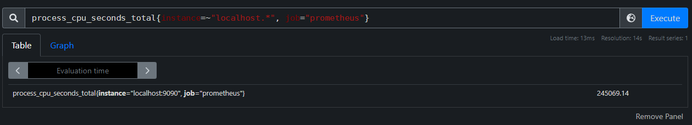

# Counters

The fundamental metric type (at least in Prometheus's metrics model) is a **Counter**. A Counter is a monotonically increasing (only counts up), floating point value that starts at 0 when initialized.

> It's important to note that when an application starts up, all of its metrics are initialized to zero and instrumentation libraries cumulatively build on this zero value through the lifetime of the application. You may have a container with a service in it that's been running for two months where a Counter has incremented itself to `1,525,783` but as soon as the container restarts that Counter will read as `0`.

Counters are useful metrics for tracking a number of times something has happened since the start of the service. Some examples of things you might track with a counter include:
- Number of requests handled
- Number of calls to an external service
- Number of responses with a particular status code
- Number of errors in processing requests
- Number of jobs executed

In our example payload, the Counter metric is represented as follows:

```
# HELP process_cpu_seconds_total Total user and system CPU time spent in seconds.
# TYPE process_cpu_seconds_total counter
process_cpu_seconds_total 693.63
```

This metric tracks the CPU time consumed by our service. It starts at 0 when the service starts and slowly climbs over time. This number will increase forever if our service never restarts. Prometheus's Counter implementation handles that by representing numbers in [E Notation](https://en.wikipedia.org/wiki/Scientific_notation#E_notation) once they get large enough. For example, `1.986087e+06` is equivalent to \\(1.986087 * 10^{6} = 1{,}986{,}087\\). Clearly, as we represent larger and larger numbers in our metrics, we lose precision, but generally the larger the numbers we are tracking, the larger the changes are and the less precision we need to identify patterns in the system.

Because counters are monotonically increasing values, even though scrape intervals may be minutes apart, we can interpolate the values in between to decent accuracy. In the image below, we know the values between Scrape 1 and Scrape 2 must be somewhere between the dotted lines, so we can estimate them as a straight line if we need to guess at the value in between scrapes.


## Querying Counter Metrics

To explore Counter metrics, let's build a Prometheus query in [PromQL](https://prometheus.io/docs/prometheus/latest/querying/basics/), Prometheus's Query Language.

To start, we can query our Prometheus instance for our counter metric by name: `process_cpu_seconds_total`.


We can see that this given Prometheus instance has eight series being returned, with each series in the form:
```
process_cpu_seconds_total{instance="<some_address>", job="<some_job_name>"}
```

Prometheus represents metrics in PromQL using the following format:

```
<metric_name>{<label_1_key>="<label_1_value>", <label_2_key>="<label_2_value>", ..., <label_n_key>="<label_n_value>"}
```

In our example, we see two different labels, `instance` and `job`. The `instance` label has eight distinct values, as does the `job` label. Prometheus generates a new time series for each unique set of label values it encounters, so while the theoretical dimensionality of this metric may be `1 * 8 * 8 = 64`, in practice there are only eight series being maintained.

Let's select one of these series to explore further.

In PromQL we can narrow the time series returned by our query by specifying filters for labels. The example below restricts the above results to only include those series where the `instance` label has a value that starts with `localhost`. To do this we use the `=~` operator on the `instance` label to filter by a regex that matches anything starting with `localhost`.

```
process_cpu_seconds_total{instance=~"localhost.*"}
```


We can further filter by `job` to end up with a single series trivially using the `=` operator. Let's filter for the `prometheus` job using the following query:

```
process_cpu_seconds_total{instance=~"localhost.*", job="prometheus"}
```

_Note that we could technically have just used the `job` query here since there is only one series with a `job` label with value `prometheus`._



From here, we can click on the `Graph` tab to view our metric in Prometheus's built-in graphing tool, though we'll go over building more interesting graphs in Grafana later.


As this is a Counter metric, we expect to see a monotonically increasing graph, which is quite clear, but why does the line look perfectly smooth if we didn't do anything to interpolate values? If we set the time range to something smaller than an hour, such as five minutes, the graph starts to look a bit different.


Now we can see the bumpiness we would expect of many discrete observations spaced an equal amount of time apart.

An even more intense zoom reveals the gap between observations to be five seconds for our given metric. Each stair step has a length of four seconds and then the line up to the next stair has a length of one second meaning our observations are separated by a total of five seconds.


While this graph is neat, it doesn't exactly make much sense as a raw series. Total CPU Seconds used by a service is interesting but it would be much more useful to see it as a rate of CPU usage in a format like CPU Seconds per Second. Thankfully, PromQL can help us derive a rate from this metric as follows:

```
rate(process_cpu_seconds_total{instance=~"localhost.*", job="prometheus"}[1m])
```

In this query we're making use of the [`rate()`](https://prometheus.io/docs/prometheus/latest/querying/functions/#rate) Query Function in PromQL which calculates the "per-second average rate of increase in the time series in the range vector". This is effectively the slope of the line of the raw observed value with a bit of added nuance. To break that down a bit, the "range vector" in our query is `[1m]`, meaning for each observation, we are grabbing the value of the metric at that time, then the values of previous observations for that metric from one minute prior to the selected observation. Once we have that list of values, we calculate the rate of increase between each successive observation, then average it out over the one minute period. For a monotonically increasing Counter value, we can simplify the equation by grabbing the first and last points in our range vector, grabbing the difference in values and dividing by the time between the two observations. Let's show it the hard way and then we can simplify.

Consider the following observations for a given counter metric, `requests`, in the form `[time, counter_value]`:

```
[0, 0], [10, 4], [20, 23], [30, 31], [40, 45], [50, 63], [60, 74], [70, 102]
```

If we wanted to take the `rate(requests{}[30s])` at the point `[40, 45]` we would grab 30 seconds worth of observations, so all those going back to `[10, 4]`. Then we calculate the increase between each successive observation:
- `[10, 4]` to `[20, 23]` -> `23 - 4 = 19` 
- `[20, 23]` to `[30, 31]` -> `31 - 23 = 8`
- `[30, 31]` to `[40, 45]` -> `45 - 31 = 14`

Since our observations are evenly spaced, we can average the per-second rate of increase as:
\\[ \frac{19}{10} + \frac{8}{10} + \frac{14}{10} = 1.\overline{33}\\]

As we're using a Counter, we can simplify the process by grabbing the first and last observations in the range and calculating the difference between them and divide by the number of seconds between the observations:
\\[ \frac{45-4}{30} = 1.\overline{33}\\]

That only gives us the `rate(requests{}[30s])` at the `time=40` point, but that process is repeated for every observation visible at the resolution we're requesting.

The result of this operation on our `process_cpu_seconds_total` metric is graphed below:

![A screenshot of the Prometheus Web UI graphing "rate(process_cpu_seconds_total{instance=~"localhost.*", job="prometheus"}[1m])" with a 1 hour window](images/counter_prom_7.png)

From this graph we can see that in the past hour our service peaks its usage at a little over `0.04` CPU Seconds per Second or around `4%` of a single CPU core.